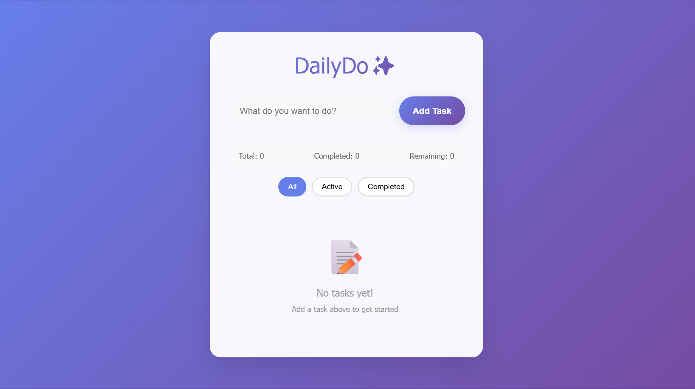

# ✨ DailyDo - A Modern Todo List

A sleek, interactive todo list application built with vanilla HTML, CSS, and JavaScript. Features a contemporary glassmorphism design with smooth animations and intuitive user experience.




## 🚀 Features

- ✅ **Add Tasks**: Quick task addition with Enter key support
- 🎯 **Mark Complete**: Visual checkbox system with completion animations
- 🗑️ **Delete Tasks**: Smooth task removal with slide-out animations
- 📊 **Real-time Statistics**: Track total, completed, and remaining tasks
- 🔍 **Smart Filtering**: Filter tasks by All, Active, or Completed status
- 🎨 **Modern Design**: Glassmorphism UI with gradient backgrounds
- 📱 **Fully Responsive**: Works perfectly on desktop, tablet, and mobile
- ⚡ **Smooth Animations**: Engaging micro-interactions throughout the app
- 🎯 **Intuitive UX**: Clean, distraction-free interface

## 🛠️ Technologies Used

- **HTML5**: Semantic markup and structure
- **CSS3**: Modern styling with gradients, animations, and responsive design
- **JavaScript**: Interactive functionality without external dependencies

## 📂 Project Structure

```
DailyDo-a-modern-todolist/
│
├── todo-list.html          # Main HTML structure
├── todo-list.css          # All styling and animations
├── todo-list.js           # Interactive functionality
└── README.md           # Project documentation
```

## 🚀 Getting Started

### Prerequisites

- A modern web browser (Chrome, Firefox, Safari, Edge)
- No additional software or dependencies required!

### Installation

1. **Clone the repository**
   ```bash
   git clone https://github.com/Amson-tECH/DailyDo-a-modern-todolist.git
   ```

2. **Navigate to the project directory**
   ```bash
   cd DailyDo-a-modern-todolist
   ```

3. **Open the application**
   - Double-click `todo-list.html` to open in your default browser
   - Or use a local server (recommended):
     ```bash
     # Using Python 3
     python -m http.server 8000
     
     # Using Node.js (if you have live-server installed)
     npx live-server
     ```

4. **Start using the todo list!**

## 💡 Usage

1. **Adding Tasks**: Type your task in the input field and press Enter or click "Add Task"
2. **Completing Tasks**: Click the circular checkbox next to any task to mark it complete
3. **Deleting Tasks**: Hover over a task and click the "Delete" button that appears
4. **Filtering**: Use the filter buttons (All, Active, Completed) to view specific task types
5. **Statistics**: Monitor your progress with the real-time stats display

## 🎨 Design Features

- **Glassmorphism Effect**: Semi-transparent containers with backdrop blur
- **Gradient Backgrounds**: Beautiful color transitions for visual appeal
- **Hover Animations**: Interactive feedback on all clickable elements
- **Smooth Transitions**: 0.3s ease transitions for professional feel
- **Custom Scrollbar**: Styled scrollbar for the task list area
- **Mobile-First**: Responsive design that works on all screen sizes

## 🔧 Customization

### Colors
The main colors can be easily customized in `todo_list.css`:

```css
/* Primary gradient colors */
background: linear-gradient(135deg, #667eea 0%, #764ba2 100%);

/* Accent colors */
--primary: #667eea;
--success: #28a745;
--danger: #ff4757;
```

### Animations
Animation timing can be adjusted:

```css
/* Transition duration */
transition: all 0.3s ease;

/* Animation keyframes can be modified for different effects */
```

## 📱 Browser Support

- ✅ Chrome (recommended)
- ✅ Firefox
- ✅ Safari
- ✅ Edge
- ✅ Mobile browsers (iOS Safari, Chrome Mobile)

## 🤝 Contributing

Contributions are welcome! Here's how you can help:

1. **Fork the repository**
2. **Create a feature branch**
   ```bash
   git checkout -b feature/amazing-feature
   ```
3. **Make your changes**
4. **Commit your changes**
   ```bash
   git commit -m "Add some amazing feature"
   ```
5. **Push to the branch**
   ```bash
   git push origin feature/amazing-feature
   ```
6. **Open a Pull Request**

### Ideas for contributions:
- Dark/Light theme toggle
- Task categories or tags
- Due dates for tasks
- Task priority levels
- Export/Import functionality
- Drag and drop reordering


## 🌟 Acknowledgments

- Inspired by modern web design trends
- Built with performance and accessibility in mind
- Special thanks to the open-source community

## 📞 Contact

Email - reubenamuzu23@gmail.com


---

⭐ **If you found this project helpful, please give it a star!** ⭐